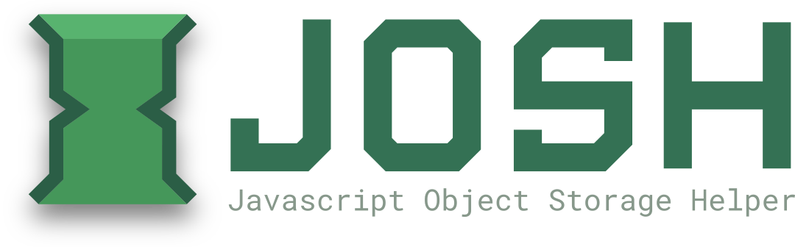

# Josh Website

**Source for the Josh Project website**

---

## Running Locally

After forking/cloning this repository to a folder locally:

1. Install dependencies with `yarn`
2. Run `yarn dev` to start the Vite development server.
